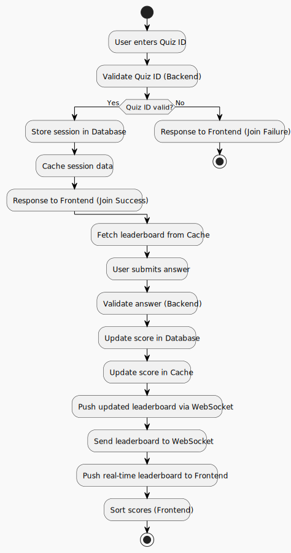

# QUIZ Overview
A real-time quiz feature for an English learning application. This feature will allow users to answer questions in real-time, compete with others, and see their scores updated live on a leaderboard.

# System Design Document
## 1. Architecture Diagram

### Components:
- Frontend: User interface for joining quizzes, answering questions, and viewing the leaderboard.
- Backend: Responsible for managing quiz sessions, validating answers, updating scores, and maintaining the leaderboard.
- Database: Stores quiz questions, user information, session data, and scores.
- WebSocket Service: Handles real-time communication between clients and the server.
- Cache (e.g., Redis): For fast leaderboard updates and temporary session data.
- API Gateway: Routes API requests to the appropriate backend services.
- Monitoring Tools: Tracks system health and logs.

## 2. Component Descriptions
### 2.1 Frontend (Client):

Displays quizzes, accepts answers, and shows the real-time leaderboard.

Communicates with the backend using REST APIs and WebSockets.

### 2.2 Backend:

- Quiz Service: Handles quiz creation, joining, and question validation.

- Leaderboard Service: Maintains and updates the leaderboard.

- Scoring Service: Calculates scores based on answers submitted.

### 2.3 Database:

Stores static data (quiz questions, user profiles) and dynamic data (sessions, scores).

- Users: user_id, name, email
- Quizzes: quiz_id, question, correct_answer
- Sessions: session_id, quiz_id, user_id, score
### 2.4 WebSocket Service:

Facilitates real-time data exchange for leaderboard updates and user interactions.

Handles bidirectional communication for scalability.

### 2.5 Cache:

Stores leaderboard data for fast retrieval.

Reduces load on the database for frequently accessed data.

## 3. Data Flow

- Joining a Quiz:
  - User enters a quiz ID on the frontend.
  - A request is sent to the backend to validate the quiz ID and join the session.
  - Session data is stored in the database and cached.

- Submitting an Answer:
  - User submits an answer via the frontend.
  - Backend validates the answer and updates the score in the database and cache.
  - Updated leaderboard is pushed to connected clients via WebSocket.

- Leaderboard Updates:
  - Scores are fetched from the cache.
  - Real-time leaderboard data is sent to clients through WebSocket.

## 4. Technologies and Tools
- Frontend: React.js for real-time UI updates and WebSocket handling.
  - Why React.js?
    - Lightweight and highly flexible, React.js is excellent for building dynamic and interactive user interfaces.
    - Provides efficient state management with tools like React Context or Redux, crucial for real-time updates in quizzes.
    - Integrates seamlessly with WebSocket libraries like SockJS and Stomp.js for real-time leaderboard updates.
- Backend: Java Spring Boot for API and WebSocket services.
  - Why Java Spring Boot?
    - Robustness and scalability: Spring Boot provides production-grade support for building highly scalable APIs.
    - WebSocket integration: Built-in Spring WebSocket support simplifies real-time communication.
    - Enterprise-grade features: Offers powerful integrations with security (e.g., Spring Security), monitoring, and caching tools.
- Database: Postgres for storing quiz and session data.
  - Why PostgreSQL?
    - Relational database management: Ideal for structured quiz data with relationships, like quizzes, users, and their answers.
    - Supports advanced querying: Features like JSON/JSONB columns provide flexibility for semi-structured session data.
- WebSocket: Spring WebSocket for real-time communication.
  - Why Spring WebSocket?
    - Seamless integration: Works natively with Spring Boot applications, leveraging existing infrastructure.
    - STOMP support: Allows structured messaging, making it easier to build and manage quiz-related topics.
- Cache: Redis for low-latency leaderboard data.
  - Why Redis?
    - Low latency: Redis provides extremely fast read and write operations, ideal for real-time leaderboard updates.
    - Pub/Sub support: Enables broadcasting leaderboard updates across multiple backend nodes in a horizontally scaled environment.
    - Data structures: Rich data structures (like hashes and sorted sets) allow efficient leaderboard storage and retrieval.
- Deployment: Docker and Kubernetes for scalability.
  - Why Docker?
    - Containerization ensures consistent environments across development, testing, and production.
    - Simplifies dependency management and application portability.
  - Why Kubernetes?
    - Orchestrates Docker containers for horizontal scalability, load balancing, and failover support.
    - Ensures high availability for backend, frontend, and Redis services, critical for real-time applications.
- Monitoring: Prometheus and Grafana for system metrics, ELK for logging.
  - Why Prometheus?
    - Collects system metrics, such as CPU, memory, and active WebSocket connections, to identify performance bottlenecks.
    - Integrates easily with Redis, Spring Boot, and Kubernetes for end-to-end monitoring.
  - Why Grafana?
    - Visualizes Prometheus metrics in intuitive, customizable dashboards.
    - Facilitates proactive monitoring with real-time alerts for potential issues, such as WebSocket overloads or Redis latency.
